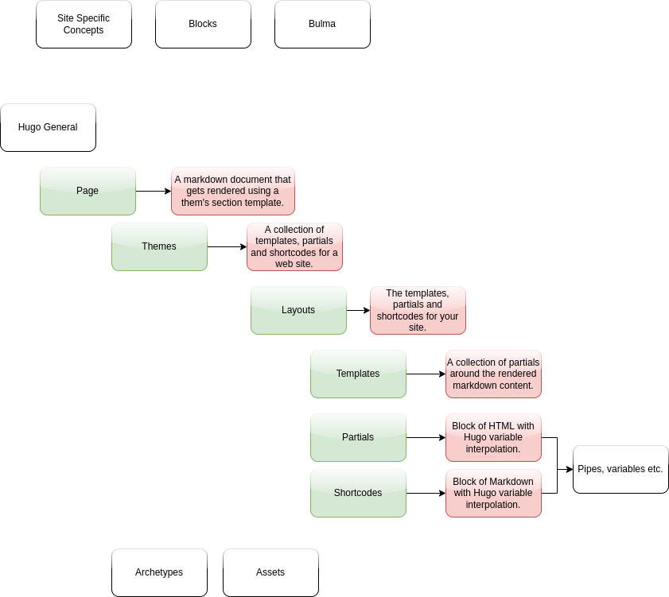

# QGIS Hugo Website

By Tim Sutton and QGIS Contributors.

[](https://github.com/qgis/QGIS-Hugo/actions/workflows/e2e.yml)

Read [this article](https://cloudcannon.com/blog/the-ultimate-guide-to-hugo-sections/) on templates if you are looking to understand how templates work.

Read [this article](https://www.regisphilibert.com/blog/2018/07/hugo-pipes-and-asset-processing-pipeline/) on hugo pipes, minifying content etc.

This theme uses the [Bulma CSS framework](https://bulma.io/), which you should familiarise
yourself with if you want to change the theme.

View the website design [QGIS website figma](https://www.figma.com/file/bHHUUVZ1fbQMtwSmtCSXYN/qgis-website?node-id=259%3A379)



## Installation

Navigate to your development directory

```
git clone https://github.com/qgis/qgis-hugo.git
```

## Development

First install hugo for your local machine:

Linux: ``sudo apt install hugo``

Windows: [Follow these notes](https://gohugo.io/installation/windows/)

MacOS: [Follow these notes](https://gohugo.io/installation/macos/)

If you are using VSCode, I recommend the following extensions:

* Hugo Language and Syntax Support

Clone the repo:

```
git clone https://github.com/qgis/qgis-hugo.git
```

Run the site:

Press ```Ctl-Shift-D``` then choose the following runner:

'Run dev using locally installed Hugo'

the click the green triangle next to  the runner to start it.

Once the site is running, you can open it at:

<http://localhost:1313>

The site will automatically refresh any page you have open if you edit it and save your work. Magical eh?

## File naming conventions

* Separate words in file names with hyphens e.g. windows-download.md
* Avoid abbreviations in the words of your files
* Write file names in lower case only
* No spaces in file names

## Changing the templates

Page type | Path
----------|---------------
Landing Page | themes/qgis/layouts/index.html
Top Level Pages | themes/qgis/layouts/_default/single.html

## Editing the landing (home) page

The ``content/_index.md`` is the content for the landing page. Just edit whatever you like there. The blocks shortcodes are described below.

## Adding a top level page

Content pages are stored in the ``content`` folder. The top level documents there will be rendered with the top level page theming.

For example to add an about page, create ``content/about.md``

The page will be accessible then at /about/

## Referencing Images and Media

Place images and media in ```static/img```. Everything in ```static``` is referenced
from the top level of the site e.g.  ```static/img/foo.png``` would be referenced in
markdown as ```/img/foo.png```.

## Modifying the menu

The menu is implemented in ```themes/qgis/layouts/partials/menu.html```.

## Working with blocks

The different types of blocks we use are defined in ```themes/qgis/layouts/shortcodes```. The main shortcodes you will use are the ones starting with ```block```. To use a block, simply add it to your markdown as per this example:

```

```

If you want to include markdown content inside the block you can do it as inner content like this:

```

More details khdkjhksj dhjfhs dkj hsfdjkh fsd

```

The options for a block are:

Name | Description
-----|-------------
title | Title for the block
subtitle | Subtitled for the block
text-color | Use a CSS colour e.g. white or #FFFFFF
background-color | Use a CSS colour e.g. white or #FFFFFF
image | Place your images into static/img and then references it like this "/img/some-image.png"

## Customising CSS

Put your customizations in ```themes/qgis/assets/css/custom.css```.

We use a hugo minification and combining  workflow - see the header layout in ```themes/qgis/layouts/partials/header.html```.

## Custom
